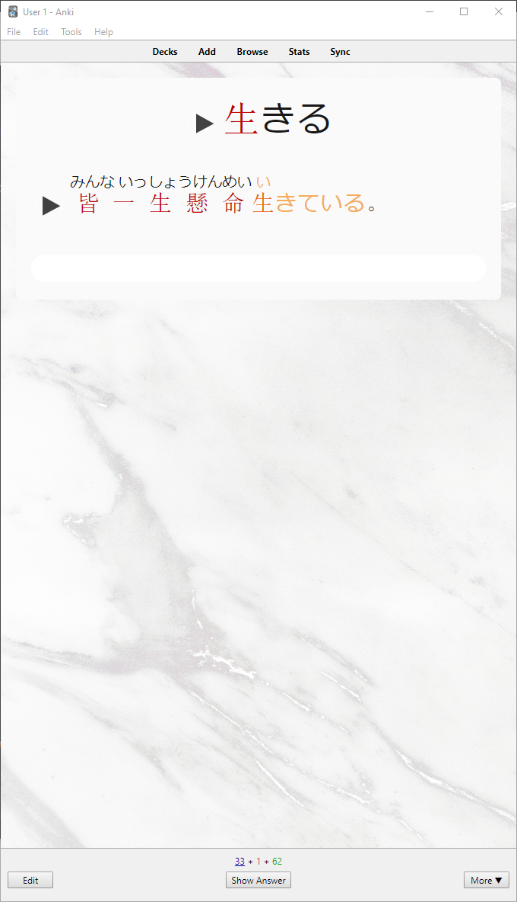
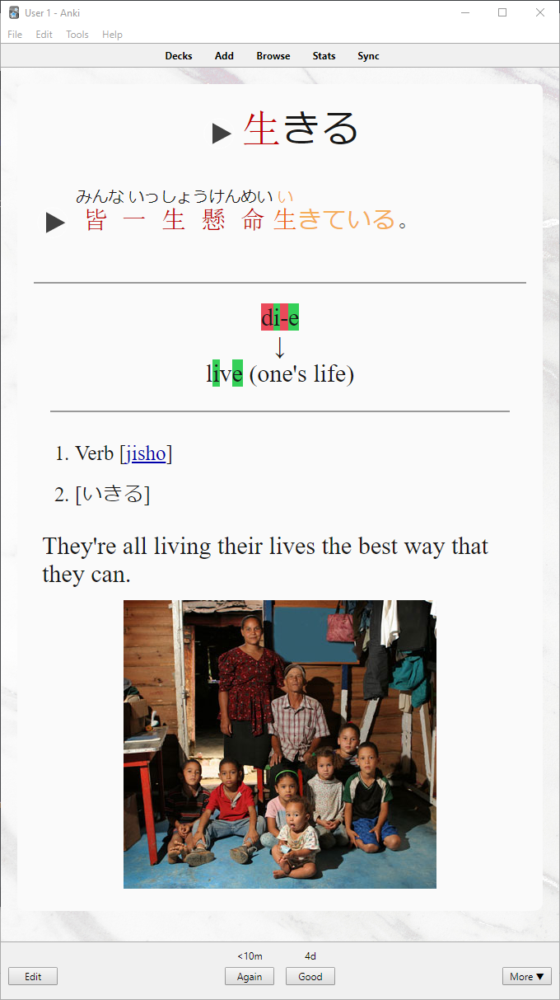

# Anki

Anki is awesome but its UI is dated. You can fix this by leveraging
Anki's powerful customization options. This repo describes the card
style I personally use. On flashcard design:

+ I greatly prefer interactivity. My cards typically use a type-in
  answer. On mobile, I turn off the typing for convenience.
+ I like audio and images in cards, not just text. This helps excite
  all senses.
+ [Kanjax](https://github.com/maurimo/KanJax) provides a popup for
  each kanji with a short description. I customized it to provide
  outlinks to popular databases (e.g., Jisho, Koohii, WaniKani,
  Wiktionary). I originally discovered this from the Anki deck
  [Jp Grammar - Tae Kim's Guide to JP w/ Diagrams, Kanji Info](https://ankiweb.net/shared/info/712638578).
+ Highlight grammar/vocab in example sentences. I originally
  discovered this from the Anki deck
  [Jp Grammar - Tae Kim's Guide to JP w/ Diagrams, Kanji Info](https://ankiweb.net/shared/info/712638578).

Front:

Back:

